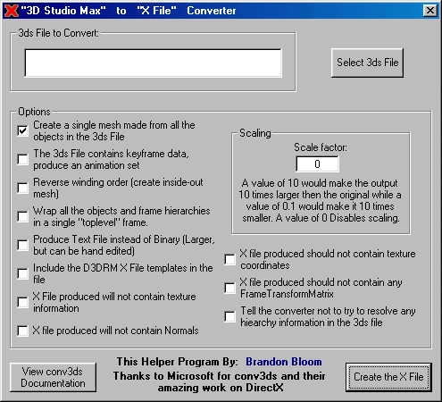



## Convert 3D Studio Max \(\*\.3ds\) files to Microsoft X Files \(\*\.x\)

### Description

<bold>ATTENTION D3D DEVELOPERS!</bold>  

Do you use 3D Studio Max to create the models for your D3D Applications? Don't have an Export Plugin and are tired of useing the command line driven conv3ds? Well this is for you!  

My application simply tailors the command line to your likings by a GUI based options menu (see screen shot) then runs conv3ds for you!  

Sure, it's real simple. It took me about 5 minutes to make, but you might not have thought of it. And now you don't have to!
 
### More Info
 
Assumed you are a D3D developer and you use 3D Studio Max to create your models

2 or 3 conv3ds options are missing, but can be easily added, just look at the code

             |
---                |---
**Submitted On**   |2001-04-28 18:09:34
**By**             |[SniperBoB](https://github.com/Planet-Source-Code/PSCIndex/blob/master/ByAuthor/sniperbob.md)
**Level**          |Beginner
**User Rating**    |5.0 (30 globes from 6 users)
**Compatibility**  |VB 5\.0, VB 6\.0
**Category**       |[Complete Applications](https://github.com/Planet-Source-Code/PSCIndex/blob/master/ByCategory/complete-applications__1-27.md)
**World**          |[Visual Basic](https://github.com/Planet-Source-Code/PSCIndex/blob/master/ByWorld/visual-basic.md)
**Archive File**   |[Convert 3D190424302001\.zip](https://github.com/Planet-Source-Code/sniperbob-convert-3d-studio-max-3ds-files-to-microsoft-x-files-x__1-22824/archive/master.zip)

### API Declarations

If you like this program please vote for me... vote if you don't like it too :-) I love feed back

